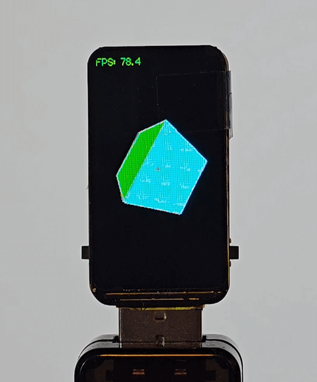

# Waveshare ESP32-S3 ST7789 172x320 3D Box Demo



ESP32-S3 driven 1.47-inch Waveshare ST7789 display demo using LovyanGFX.

## Overview
- Renders a rotating 3D cube with face culling and per-face lighting.
- Uses a soft sprite buffer and custom `LGFX` display class.

This project is a compact ESP32-S3 (Waveshare 1.47" ST7789 172×320) demo that renders a rotating 3D cube with backface culling, depth-sorted faces, and simple ambient/diffuse/specular shading with around 80 FPS.

## Features
- 3D cube transform (rotation, projection)
- Backface culling based on 2D screen area sign
- Phong-like shading (ambient/diffuse/specular)
- FPS measuring and display

## Hardware
- Board: Waveshare ESP32-S3 1.47inch Display Development Board (172×320, 262K colors)
  - ESP32-S3 SoC (up to 240MHz, WiFi + Bluetooth)
  - Integrated 1.47" ST7789 display, 172×320 resolution
  - On-board RGB LED
  - Includes touchscreen-capable pins (if present on the module)
- Compatible Host: ESP32-S3-DevKitM-1 and similar boards

## Detailed Features of Waveshare Board
- LCD: ST7789, 262K colors, 172×320 pixels
- CPU: ESP32-S3 dual-core RISC-V
- Memory: 512KB RAM on-chip + external SPI flash support
- Peripherals: SPI, I2C, UART, PWM, ADC, etc.
- Display interface: SPI (MOSI/MISO/SCLK/DC/CS/RST/BL)

## Wiring (SPI)
Use this wiring for the display interface and LCD power/backlight control:
- SCLK -> GPIO 40
- MOSI -> GPIO 45
- MISO -> (unused, driven as -1 in code)
- DC -> GPIO 41
- CS -> GPIO 42
- RST -> GPIO 39
- BL -> GPIO 48

# Notes
- Requires LovyanGFX 1.x and Arduino framework for PlatformIO.
- To enable RGB LED updates or other board features, add code in `setup()`.

## Build and Upload
```bash
platformio run --target upload
```

## Notes
- The code uses LovyanGFX 1.x and Arduino framework.
- RTT-safe printf is used for FPS logging over serial.
- Observed performance: ~80 FPS on the target hardware.

## Contact
If you have any questions or want to collaborate on projects, feel free to reach out. Do not hesitate to comment or submit PRs.

- Sayed Ahmadreza Razian
- AhmadrezaRazian@gmail.com
- https://www.linkedin.com/in/ahmadrezarazian/